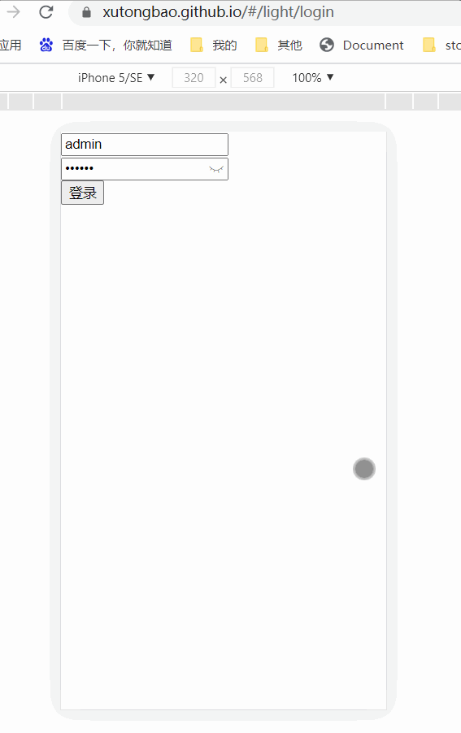
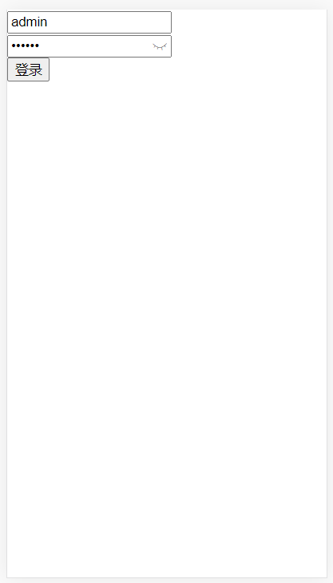
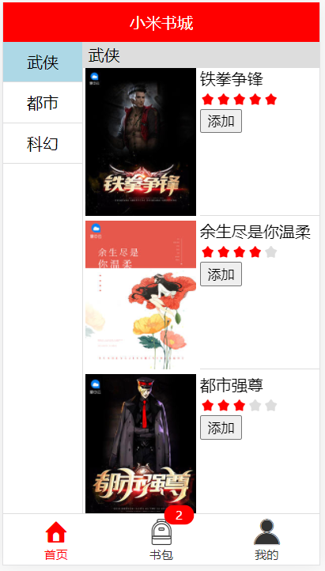
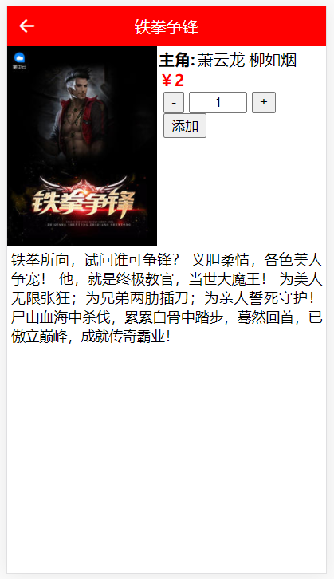
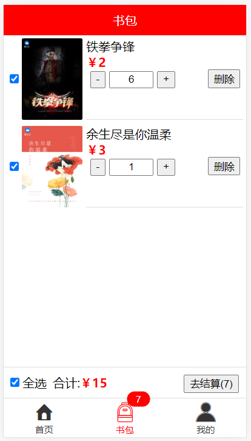

小米书城 Vue3 版本线上预览地址：[https://xutongbao.github.io/](https://xutongbao.github.io/),建议使用手机模式打开。

前后端分离版本包括二个仓库：
- [小米书城后端接口 m-node](https://github.com/xutongbao/m-node)
- [小米书城 Vue3 版本 xutongbao.github.io](https://github.com/xutongbao/xutongbao.github.io)

**坚持不易，如果觉得项目还不错的话可以给项目一个 Star 吧，也是对我一直更新代码的一种鼓励啦，谢谢各位的支持。**

## 开发及部署文档
- [托管node项目平台介绍](https://blog.csdn.net/xutongbao/article/details/116641092)
- [github.io托管vue3.0项目](https://blog.csdn.net/xutongbao/article/details/116641459)

## 页面展示

以下为新蜂商城 Vue3 版本的页面预览：

- 登录页

- 首页

- 详情页

- 书包页

## 联系作者

> 大家有任何问题或者建议都可以在 [issues](https://github.com/xutongbao/xutongbao.github.io/issues) 中反馈给我，我会慢慢完善这个项目。

- 我的邮箱：1183391880@qq.com
- 我的微信：xu1183391880
- 我的博客：[https://blog.csdn.net/xutongbao](https://blog.csdn.net/xutongbao)
- QQ技术交流群：668352707

## 感谢

- [Vue](https://github.com/vuejs/vue)
- [Vue-Router](https://github.com/vuejs/vue-router-next)
- [Vuex](https://github.com/vuejs/vuex/tree/4.0)
- [Axios](https://github.com/axios/axios)
- [Node](https://github.com/nodejs/node)